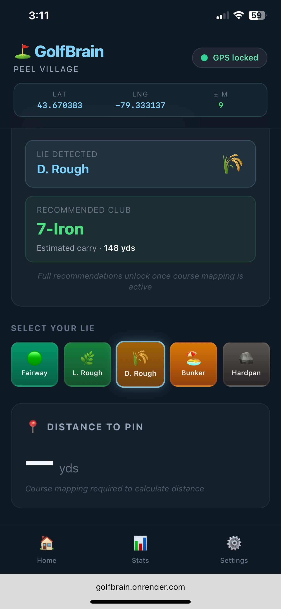

# ⛳ GolfBrain™
### *Your AI Caddie. One Tap. Surface The Right Shot.*

> *"Tiger Woods spent 5 minutes figuring out a complex, amazing shot. GolfBrain gives every golfer that same decision — instantly."*

---

## Table of Contents

1. [What is GolfBrain?](#what-is-golfbrain)
2. [The Problem GolfBrain Solves](#the-problem-golfbrain-solves)
3. [The Variables Every Golfer Must Consider](#the-variables-every-golfer-must-consider)
4. [Fly-and-Curve™](#fly-and-curve)
5. [Fly-and-Drive™](#fly-and-drive)
6. [The Shot Menu](#the-shot-menu)
7. [How GolfBrain Thinks](#how-golfbrain-thinks)
8. [The Output — Top 3 Shot Recommendations](#the-output--top-3-shot-recommendations)
9. [How GolfBrain Learns Your Game](#how-golfbrain-learns-your-game)
10. [Version 1 Objectives](#version-1-objectives)
11. [Version 2 Objectives](#version-2-objectives)
12. [Tech Stack](#tech-stack)
13. [Why This Is Buildable](#why-this-is-buildable)

---

## What is GolfBrain?

GolfBrain™ is a **personalized AI caddie** that condenses a golfer's full shot menu — 9 Fly-and-Curve™ aerial shapes, 9 Fly-and-Drive™ ground-steered options, plus pitch and chip clock-system variations — into the **top 3 ranked recommendations** based on GPS position, personal dispersion patterns, lie type, and on-the-day conditions.

It is not a GPS app.
It is not a stat-tracking app.
It is not a swing coach.
It is not DECADE.

**It is a decision engine.**

A competent golfer has an enormous shot menu — potentially 30+ viable options from any position on the course. The human brain, under mild pressure, defaults to the same 2 or 3 shots it always hits. Not because the other shots aren't available — but because evaluating all of them simultaneously against hole geometry, lie, wind, and personal dispersion is computationally impossible in the moment.

GolfBrain does that computation instantly and collapses the decision space to exactly 3 shots, ranked by what actually matters that day.

---

## The Problem GolfBrain Solves

### The Inspiration

In the second round of the 2019 World Golf Championships–Mexico Championship, Tiger Woods hit a 132-yard bunker shot on the par-4 9th hole to 11 feet, then two-putted for par.

He was in a greenside bunker. The pin was on the right side of the green. A tree blocked the direct line. Tiger spent approximately 5 minutes working through his options and rehearsing practice swings.

https://youtu.be/Rl_oUUQlk24?si=mbi0s5nMnJGDUF-I

What he did — intentionally — was this:

- Played an outside-in swing path with an open clubface
- Landed the ball on the **left side of the green**
- The spin and path combination caused the ball to take a **severe right turn on the ground**
- The ball curled toward the pin and finished 11 feet away

He controlled the ball's behavior **after it landed**. On purpose. That is Fly-and-Drive™.

A 14-handicap golfer standing over that same shot would never have considered it. Their brain, under pressure, would default to "try to fly it at the pin" or "splash it out safe." The Fly-and-Drive™ option — the highest EV shot on that hole in those conditions — simply wouldn't exist in their mental menu.

**GolfBrain puts it there.**

---

## The Variables Every Golfer Must Consider

Before hitting any shot, a complete decision requires evaluating all of the following variables simultaneously. This is what GolfBrain automates.

---

### 1. Lie Type
The single most important variable. Determines which shot types are physically possible.

| Lie | Effect on Shot |
|---|---|
| **Fairway** | Full shot menu available |
| **Light Rough** | Slightly reduced spin control, small distance loss |
| **Deep Rough** | Severely reduced spin, flyer risk, limited shot shaping |
| **Bunker** | Open face required, limited distance, Fly-and-Drive™ highly viable |
| **Hardpan / Bare Lie** | Low trajectory preferred, run-up shots viable |
| **Divot** | Ball will fly lower, less spin, adjust landing expectations |
| **Upslope** | Ball launches higher, draws more easily |
| **Downslope** | Ball launches lower, fades more easily |
| **Side Hill (ball above feet)** | Draw bias, aim right |
| **Side Hill (ball below feet)** | Fade bias, aim left |

---

### 2. Distance to the Pin
The foundational number. Determines club selection range and shot type viability.

- Distance to **front of green**
- Distance to **center of green**
- Distance to **back of green**
- Distance to **pin** (current day position)
- **Effective distance** after wind and elevation adjustments

---

### 3. Pin Position
Where the flag is located dramatically changes which shots are safe and which are suicidal.

| Pin Position | Strategic Implication |
|---|---|
| **Front Left** | Long and right is safe; short is dead |
| **Front Right** | Long and left is safe; short is dead |
| **Middle Center** | Most forgiving; full shot menu available |
| **Back Left** | Short and right misses are recoverable |
| **Back Right** | Short and left misses are recoverable |
| **Tucked (any corner)** | Consider Fly-and-Drive™ to approach from an angle |

---

### 4. Wind
Affects carry distance, shot shape, and landing behavior.

| Variable | Effect |
|---|---|
| **Headwind** | Reduces carry; take more club; ball stops faster |
| **Tailwind** | Increases carry; take less club; ball releases more |
| **Left crosswind** | Pushes ball right; aim left or play a draw |
| **Right crosswind** | Pushes ball left; aim right or play a fade |
| **Wind strength** | Light (1–2 club), Moderate (2–3 club), Strong (3+ club) |
| **Gusting** | Favour lower trajectory to reduce exposure |
| **Wind at height** | Different direction aloft vs. at ground level |

*Rule of thumb: 10 mph headwind = 1 extra club. 10 mph tailwind = 1 less club.*

---

### 5. Temperature
Affects air density and therefore ball carry distance.

| Temperature | Carry Effect |
|---|---|
| **Cold (below 5°C / 40°F)** | Ball flies 5–10 yards shorter; cold compresses the ball |
| **Cool (5–15°C / 40–60°F)** | Moderate distance loss (~3–5 yards) |
| **Warm (15–25°C / 60–77°F)** | Standard distances |
| **Hot (above 25°C / 77°F+)** | Ball flies slightly farther; air is less dense |

*For Seasonal golfers: early morning rounds in spring can cost you 10+ yards on longer clubs.*

---

### 6. Elevation Change
Uphill and downhill shots require yardage adjustment independent of wind.

| Scenario | Adjustment |
|---|---|
| **Uphill** | Add yards (ball lands shorter than flat carry) |
| **Downhill** | Subtract yards (ball carries farther effectively) |
| **Rule of thumb** | Every 10 feet of elevation change ≈ 1 yard adjustment |

---

### 7. Humidity and Altitude
Secondary factors that affect air density.

- **High humidity** — marginally less dense air, very slight distance gain
- **High altitude** — significantly less air resistance; ball carries 5–15% farther at elevation
- **Sea level** — standard baseline distances

---

### 8. Hazard Geometry
The spatial constraints that define which shots are viable.

- **Water carry required** — minimum carry distance to clear
- **Bunker positions** — left, right, front, back of green
- **Out of bounds lines** — hard penalty; shapes aggressive vs. conservative decision
- **Trees** — height, density, and position relative to ball flight window
- **Rough boundaries** — penalty rough vs. playable rough
- **Green surrounds** — false fronts, run-off areas, chipping vs. putting surfaces

---

### 9. Green Characteristics
Determines landing zone requirements and post-landing behavior.

- **Green firmness** — soft greens stop the ball; firm greens release
- **Green slope direction** — feeds the ball toward or away from the pin
- **Green speed** — affects putting after approach but also informs landing strategy
- **Green size** — large greens are more forgiving; small greens require precision
- **Apron / fringe** — can be used intentionally as a run-up landing zone
- **False front** — anything landing short feeds back off the green

---

### 10. Rollout and Ground Conditions
The ground between you and the target matters — especially for Fly-and-Drive™.

- **Firm fairway** — increases rollout dramatically; Fly-and-Drive™ highly viable
- **Soft fairway** — ball plugs on landing; Fly-and-Drive™ less effective
- **Wet conditions** — reduces spin effectiveness; ball skids rather than checks
- **Grain direction** — affects putting but also chip and run behavior on aprons

---

### 11. Personal Dispersion Pattern
Your individual shot pattern — the most underrated variable in amateur golf.

- **Carry distance** per club (not your best; your average)
- **Dispersion width** — how far left/right your misses travel
- **Dispersion height** — how much short/long variation you have
- **Miss bias** — do you miss predominantly left or right?
- **Shot shape bias** — natural draw or fade tendency?
- **Under pressure patterns** — does your miss change under pressure?

---

### 12. Mental and Physical State
Variables GolfBrain acknowledges but cannot fully quantify.

- Fatigue level (late in round)
- Confidence with specific clubs on the day
- Recent shot history (have you been hitting it well?)
- Comfort with required shot type

---

## Fly-and-Curve™

Fly-and-Curve™ describes all shots where the ball travels through the air to its destination. The ball's **flight path** is the primary delivery mechanism. Ground behavior after landing is secondary.

### The Three Shot Shapes

| Shape | Description | When to Use |
|---|---|---|
| **Straight** | Minimal lateral curve; square face to path | Most conditions; neutral geometry |
| **Draw** | Ball curves right-to-left (for right-handed golfer) | Dogleg left; right pin with left bunker; into right-to-left wind |
| **Fade** | Ball curves left-to-right (for right-handed golfer) | Dogleg right; left pin with right bunker; into left-to-right wind |

### The Three Trajectories

| Height | Description | When to Use |
|---|---|---|
| **Low** | Penetrating ball flight; less wind exposure | Into headwind; firm fairways; bump-and-run approaches |
| **Mid** | Standard trajectory | Neutral conditions; most approach shots |
| **High** | High launch with steep descent angle | Soft greens requiring ball to stop quickly; shots over obstacles |

### The 9 Fly-and-Curve™ Combinations

| | Low | Mid | High |
|---|---|---|---|
| **Draw** | Low Draw | Mid Draw | High Draw |
| **Straight** | Low Straight | Mid Straight | High Straight |
| **Fade** | Low Fade | Mid Fade | High Fade |

### How to Produce Each Shape

**Draw:** Closed clubface slightly relative to swing path; swing path right of target; ball starts right, curves left.

**Fade:** Open clubface slightly relative to swing path; swing path left of target; ball starts left, curves right.

**Low:** Ball back in stance; hands forward at address; abbreviated follow-through; de-lofts the club.

**High:** Ball forward in stance; weight slightly back; full follow-through; uses full loft of club.

### The Clock System for Direction

GolfBrain uses clock positions to communicate start line:

- **12 o'clock** — straight at target
- **11 o'clock** — slightly left of target (draw start line)
- **10 o'clock** — further left (stronger draw)
- **1 o'clock** — slightly right of target (fade start line)
- **2 o'clock** — further right (stronger fade)

*Example output: "Start at 11 o'clock, high draw — ball will curve back to the pin."*

---

## Fly-and-Drive™

Fly-and-Drive™ is GolfBrain's proprietary shot category describing shots where the ball is **intentionally landed away from the final target**, with ground behavior — driven by spin and swing path — used to steer the ball to the hole.

Most golfers have accidentally hit Fly-and-Drive™ shots their entire career. Every snap-hook that ran left, every cut that trickled right — that was ground-steered spin. GolfBrain makes it intentional, deliberate, and precise.

### The Physics

Post-landing ball behavior is determined by two inputs:

1. **Swing path** (outside-in / down the line / inside-out)
2. **Clubface angle at impact** (closed / square / open)

These two variables create a predictable and repeatable matrix of ground behaviors.

---

### The Fly-and-Drive™ Matrix

| Clubface | Path | Post-Landing Behavior |
|---|---|---|
| **Closed** | Outside-in | Severe left turn; lands and trickles left; or rolls curving left |
| **Square** | Outside-in | Spin back toward player |
| **Open** | Outside-in | Lands and trickles right |
| **Closed** | Down the line | Lands and trickles left |
| **Square** | Down the line | Plop and stop (minimal ground movement) |
| **Open** | Down the line | Lands and trickles right |
| **Closed** | Inside-out | Lands and rolls curving left |
| **Square** | Inside-out | Land and roll out (straight forward roll) |
| **Open** | Inside-out | Severe right turn; lands and trickles right; or rolls curving right |

---

### The 9 Fly-and-Drive™ Variations

**1. Severe Left Turn**
- Path: Outside-in | Face: Closed
- Ball lands and takes a hard left turn on the ground
- *Use when:* pin is left, approach from the right, firm ground

**2. Land and Trickle Left**
- Path: Outside-in or Down-line | Face: Closed
- Gentle leftward ground movement after landing
- *Use when:* slight left pin position, firm apron

**3. Land and Roll Curving Left**
- Path: Inside-out | Face: Closed
- Progressive left curve across the ground
- *Use when:* firm green, left pin, run-up available

**4. Spin Back**
- Path: Outside-in | Face: Square
- Ball checks and reverses toward player
- *Use when:* pin is front, short-sided risk behind, firm green

**5. Plop and Stop**
- Path: Down the line | Face: Square
- Minimal ground movement; ball sits where it lands
- *Use when:* soft conditions, precise landing zone required

**6. Land and Roll Out**
- Path: Inside-out | Face: Square
- Straight forward roll after landing
- *Use when:* firm fairway, run-up to elevated green, links conditions

**7. Severe Right Turn**
- Path: Inside-out | Face: Open *(Tiger's Mexico shot)*
- Ball lands and takes a hard right turn on the ground
- *Use when:* pin is right, blocked direct line, firm ground available

**8. Land and Trickle Right**
- Path: Down-line or Outside-in | Face: Open
- Gentle rightward ground movement after landing
- *Use when:* slight right pin, run-up available

**9. Land and Roll Curving Right**
- Path: Inside-out | Face: Open
- Progressive right curve across the ground
- *Use when:* firm green, right pin, run-up available

---

### How to Produce Fly-and-Drive™ Shots

**Steep / Vertical Backswing** — Promotes outside-in path; generates more backspin and left-to-right spin axis for rightward ground curve.

**Flat / Horizontal Backswing** — Promotes inside-out path; generates draw spin and rightward ground movement.

**Open Face at Address** — Adds loft and right-to-left spin axis tilt; promotes rightward ground curve on landing.

**Closed Face at Address** — Reduces loft; promotes leftward ground curve on landing.

**Ground Conditions** — Fly-and-Drive™ effectiveness scales with firmness. Firm fairways and firm greens amplify ground movement. Soft, wet conditions reduce it significantly.

---

### Why Fly-and-Drive™ is Underused by Amateurs

Most amateur golfers think in two dimensions — carry the ball to the target. Fly-and-Drive™ introduces a third dimension: the ground as a delivery system.

A 14-handicap golfer in a bunker with a right pin and a tree blocking the direct line has more options than they think. They can aim left, use spin to curve the ball right, and have the geometry do the work. This is exactly what Tiger did. It was not beyond his physical ability — he simply saw the option and had the knowledge to execute it.

GolfBrain sees those options for you.

---

## The Shot Menu

The complete set of shots GolfBrain evaluates on every recommendation:

| Category | Variations | Total |
|---|---|---|
| Fly-and-Curve™ | 3 shapes × 3 heights | 9 |
| Fly-and-Drive™ | 3 paths × 3 face angles | 9 |
| Pitch shots | 5 clock positions × clubs | Variable |
| Chip shots | 5 clock positions × clubs | Variable |

### The Clock System for Pitch and Chip Distance

For any wedge or short iron, backswing length controls distance:

| Clock Position | Backswing Length | Distance |
|---|---|---|
| 7 → 5 o'clock | Shortest | ~10–20 yards |
| 8 → 4 o'clock | Short | ~20–40 yards |
| 9 → 3 o'clock | Half swing | ~40–60 yards |
| 10 → 2 o'clock | Three-quarter | ~60–80 yards |
| Full swing | Full | Maximum carry |

*Distances are illustrative. GolfBrain calibrates to your personal carry numbers.*

---

## How GolfBrain Thinks

### Step 1 — Locate You (GPS)
GolfBrain uses your phone's GPS to determine your exact position on the course. It automatically calculates:
- Which hole you're on
- Distance to pin
- Distance to carry each hazard
- Which zone you're in (fairway / rough / bunker polygon)

### Step 2 — Build Your Shot Menu
Based on your lie type (the one tap input), GolfBrain filters the full shot menu to shots that are physically executable from your current lie.

### Step 3 — Overlay Your Dispersion Pattern
GolfBrain stores a 2D dispersion ellipse per club:
- Width (left/right spread)
- Height (long/short spread)
- Curvature bias
- Miss tendency direction

It overlays your personal pattern onto each possible shot and the hole geometry.

### Step 4 — Score Every Shot
For each viable shot, GolfBrain computes:
- Probability of safe landing
- Probability of short-siding
- Probability of hazard
- Expected next-shot distance
- Expected strokes gained

### Step 5 — Rank the Top 3
GolfBrain outputs exactly 3 recommendations — never more, never fewer.

---

## The Output — Top 3 Shot Recommendations

```
─────────────────────────────────────
SHOT #1 — HIGHEST EV
─────────────────────────────────────
Club          9 Iron
Start         11 o'clock
Height        High
Type          Fly-and-Drive™

Carry         128 yards
Land          Left fringe
Finish        Curls hard right → pin

HOW TO HIT IT
↑  Steep backswing
→  Outside-in path
⟳  Open face at address

Miss          Short left = safe
              Long left = trouble
─────────────────────────────────────
SHOT #2 — SAFEST
─────────────────────────────────────
Club          8 Iron
Start         12 o'clock
Height        Mid
Type          Fly-and-Curve™ Straight

Carry         132 yards
Land          Center of green
Finish        20 feet from pin

HOW TO HIT IT
▸  Standard setup
▸  Committed swing
▸  Trust your dispersion

Miss          Any miss leaves a putt
─────────────────────────────────────
SHOT #3 — AGGRESSIVE
─────────────────────────────────────
Club          9 Iron
Start         1 o'clock
Height        High
Type          Fly-and-Curve™ Fade

Carry         132 yards
Land          Pin high, right edge
Finish        Tight to pin

HOW TO HIT IT
↑  Open stance slightly
→  Cut across the ball
⟳  Hold face open through impact

Miss          Right = bunker risk
              Left = safe
─────────────────────────────────────
```

---

## How GolfBrain Learns Your Game

Golfers lie. Golfers overestimate. Golfers don't know their numbers. GolfBrain uses a three-layer system to converge on your true tendencies without requiring data entry.

### Layer 1 — Default Shot Patterns
On first launch, GolfBrain seeds your dispersion model from:
- Your handicap index
- Your 7-iron carry distance
- Standard dispersion tables for your handicap band

### Layer 2 — Micro-Feedback
After each shot, GolfBrain asks one binary question:
- *"Miss left or right?"*
- *"Long or short?"*
- *"More curve or less than expected?"*

No typing. No data entry. One tap. Over time these micro-responses converge your dispersion model to your actual pattern.

### Layer 3 — In-Round Inference
GolfBrain learns from:
- Which club you actually selected vs. recommended
- Which target you chose vs. recommended
- Shot selection patterns over multiple rounds

This passive learning layer continuously refines your model without any deliberate input.

---

## 📸 App Screenshot



---

## Version 1 Objectives

**Platform:** PWA (Progressive Web App) — offline-first, installable on iPhone home screen
**Course:** Peel Village Golf Course, Brampton, Ontario (9 holes) only
**User:** Single user (developer)
**Backend:** None — fully client-side

### V1 Feature Set

**GPS Engine**
- [ ] Auto-detect current hole from GPS position
- [ ] Auto-calculate distance to pin
- [ ] Auto-calculate distance to carry each hazard
- [ ] Detect zone (fairway / rough / bunker polygon)

**Course Data**
- [ ] All 9 holes of Peel Village encoded as static JSON
- [ ] GPS coordinates: tee box, green front/center/back, all hazards
- [ ] Fairway width at landing zones
- [ ] 6 pin positions per hole

**User Profile**
- [ ] Club distances for full bag
- [ ] Dispersion ellipses per club (seeded from handicap defaults)
- [ ] Shot shape bias and miss tendencies
- [ ] Stored in IndexedDB (offline persistent)

**Shot Engine**
- [ ] Fly-and-Curve™ library (9 combinations)
- [ ] Fly-and-Drive™ library (9 combinations)
- [ ] Pitch shot clock system (5 distances)
- [ ] Chip shot clock system (5 distances)
- [ ] EV scoring with static strokes-gained lookup table
- [ ] Lie-based shot filter
- [ ] Wind adjustment model
- [ ] Temperature adjustment model

**UI**
- [ ] Dark theme, sunlight-readable
- [ ] Overhead hole schematic with GPS position marker
- [ ] Lie selector (5 options — one tap)
- [ ] Pin position selector (9 positions — one tap per hole)
- [ ] Top 3 shot output cards with execution cues
- [ ] Wind input (auto-fetched or manual override)

**PWA**
- [ ] Service worker for full offline capability
- [ ] Add to Home Screen installable
- [ ] IndexedDB for all persistent data
- [ ] Instant load after first visit

### V1 Definition of Done
Standing on any hole at Peel Village, tap lie type, receive 3 ranked shot recommendations including at least one Fly-and-Drive™ option when hole geometry rewards it — all within 2 seconds, fully offline.

---

## Version 2 Objectives

**Platform:** PWA (expanded) + potential native app consideration
**Courses:** Multi-course via golf course data API (iGolf or equivalent)
**Users:** Multi-user with accounts

### V2 Feature Set

**Course Database**
- [ ] Integration with iGolf API (40,000+ courses worldwide)
- [ ] 1-metre terrain data for Fly-and-Drive™ slope modeling
- [ ] Green heat maps for slope-aware approach recommendations
- [ ] 2D hole maps rendered from iGolf GeoData
- [ ] Auto-course detection on launch

**Adaptive Dispersion Model**
- [ ] Micro-feedback loop fully implemented
- [ ] In-round inference engine
- [ ] Per-club dispersion ellipse convergence
- [ ] Confidence scoring per club (how well-calibrated is this club?)

**Enhanced Shot Engine**
- [ ] Slope-aware Fly-and-Drive™ (terrain data informs post-landing behavior)
- [ ] Green firmness integration
- [ ] Elevation-adjusted carry distances
- [ ] Hook and slice as emergency recovery shot options

**Monetization**
- [ ] Free tier: default dispersion patterns, basic shot recommendations
- [ ] Paid tier: adaptive model, full Fly-and-Drive™ library, terrain-aware recommendations
- [ ] Subscription model (monthly / annual)

**Multi-User**
- [ ] Account creation and authentication
- [ ] Cloud sync of dispersion profiles
- [ ] Profile portability across devices

**Apple Watch**
- [ ] Glanceable output on wrist
- [ ] Lie selection from watch
- [ ] Haptic confirmation

**Potential V2+ Features**
- [ ] Round history (optional, not core)
- [ ] Handicap tracking integration
- [ ] Sharing individual hole recommendations
- [ ] Pre-round course strategy view ("here's the 3 holes that will make or break your round")

---

## Tech Stack

| Layer | Technology |
|---|---|
| **Framework** | React + Vite |
| **Styling** | Tailwind CSS |
| **PWA** | Vite PWA Plugin + Workbox |
| **Offline Storage** | IndexedDB via `idb` library |
| **GPS** | Web Geolocation API |
| **Weather** | Open-Meteo API (free, no key required) |
| **Course Data (V1)** | Static JSON (hand-encoded) |
| **Course Data (V2)** | iGolf Connect® API |
| **Hosting** | Render.com (static site, free tier) |
| **CI/CD** | GitHub → Render auto-deploy |
| **IDE** | Cursor |

---

## Why This Is Buildable

- ✅ React + Vite skills already in place
- ✅ PWA architecture already deployed and working
- ✅ Golf domain knowledge (14 handicap, 16 years CRE analytical thinking applied to sport)
- ✅ ML skills for dispersion modeling and EV computation
- ✅ Single course for V1 eliminates data complexity
- ✅ No backend required for V1
- ✅ Zero hosting cost on Render free tier
- ✅ One beta tester who plays the course regularly
- ✅ Clear definition of done

GolfBrain is the perfect engineer-founder micro-SaaS: a genuine personal problem, a defensible technical moat (Fly-and-Drive™), a clear V1 scope, and a path to a product that serves every 10–20 handicap golfer in the world.

---

## The Tagline

> *"Stop overthinking. Start executing."*

---

*GolfBrain is built and maintained by a golfer, for golfers.*
*Fly-and-Drive™ and Fly-and-Curve™ are proprietary shot classification systems.*
*V1 is Peel Village only. V2 is everywhere.*
